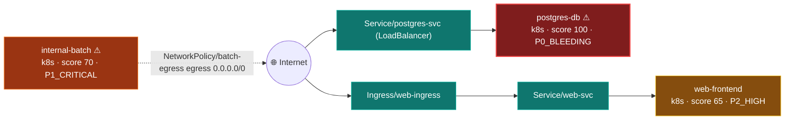

# Reticulum

**Cloud-Native Contextual Security Prioritizer by PLEXICUS**


[](https://www.plexicus.ai)
[](LICENSE)
[]()

> **By:** [PLEXICUS](https://www.plexicus.ai) - AI-Driven ASPM Platform

Reticulum is a high-performance security analysis engine that prioritizes vulnerabilities based on their **actual exposure** in Kubernetes environments. Instead of treating all HIGH/CRITICAL vulnerabilities equally, Reticulum analyzes your deployment architecture (Ingress, Istio, Service Mesh) to determine which services are truly exposed and adjusts risk scores accordingly.

## 🎯 Core Principle

**"Context is King."**

A **MEDIUM** severity vulnerability in a public-facing, privileged authentication service is **CRITICAL**.
A **HIGH** severity vulnerability in a locked-down, internal-only worker is **LOW PRIORITY**.

Reticulum automates this logic.

## 🚀 Key Features

### 🗺️ Multi-Source Resource Mapping
One inventory, four discoverers — see [docs/sources.md](docs/sources.md):
- **Helm charts**: `Chart.yaml` + every values variant (`values-prod.yaml`, …)
- **Raw Kubernetes manifests**: Deployments, StatefulSets, DaemonSets, Jobs,
  CronJobs, Pods — multi-document files included
- **docker-compose**: services, build contexts and published ports
- **Dockerfiles**: `Dockerfile`, `Dockerfile.<name>`, `<name>.Dockerfile`

### 🔍 Exposure Traceability
Reticulum doesn't guess that something is public — it **proves the path**,
resolving label selectors and backend references across manifests:

```
Ingress/web-ingress → Service/web-svc → Deployment/web-frontend
Service/postgres-svc (LoadBalancer) → StatefulSet/postgres-db
NetworkPolicy/batch-egress egress 0.0.0.0/0 ← Deployment/internal-batch
```

Chains appear in the CLI, in the JSON report (`exposurePaths`) and as a
**Mermaid exposure graph** (`--graph`) you can paste into any README or PR.

### 🧠 Advanced Rule Engine (DSL v2)
- **Custom Logic**: prioritization and suppression rules in simple YAML.
- **Powerful matching**: wildcards (`containers.*.securityContext.privileged`),
  escaped dots for annotation keys, OR blocks (`any:`), `in`/`gte`/`lte`/
  `not_exists`, regex — over Helm values, chart metadata, raw manifests
  (`kind:` filtered), compose services and SARIF findings.
- **Contextual Scoring**: boost crown jewels (Auth, Payments), relax internal
  tools, suppress accepted risks — as reviewable, versioned code.
- [**Full DSL Reference & Cookbook**](RULES.md)

### 🌐 Exposure Detection
- **Ingress Controllers**: NGINX, Traefik, HAProxy
- **Service Mesh**: Istio VirtualServices & Gateways
- **Gateway API**: HTTPRoutes (values-based and raw `HTTPRoute` manifests)
- **Cloud LoadBalancers / NodePorts**: values-based and raw `Service` manifests
- **Ambassador/Emissary**: Mappings
- **docker-compose**: published ports (loopback binds correctly ignored)
- **NetworkPolicies**: open egress to `0.0.0.0/0`

### 🛡️ Security Context Analysis
- **Privileged Containers**: Helm values, raw manifests (any container via
  wildcards) and compose `privileged: true`.
- **Host Access**: `hostNetwork`, `network_mode: host`, `hostPath` mounts.
- **Capabilities**: dangerous Linux capabilities (e.g., `SYS_ADMIN`).
- **Service Account Mounting**: token automount detection — and hardening
  recognition when it's explicitly disabled.
- **Cloud IAM**: IRSA / GCP Workload Identity bindings.

### 🔌 Native Integrations
- **Infrastructure**: Trivy (Container & FS scanning)
- **Code**: Semgrep (SAST) — any SARIF producer works
- **Output**: JSON reports, Enriched SARIF, CLI summaries, Mermaid graphs
- **CI**: GitHub Actions recipe in [docs/integrations.md](docs/integrations.md)

## 📦 Installation


### **🐳 Docker (Recommended)**

Reticulum supports multi-architecture builds out of the box (Apple Silicon/ARM64 and Intel/AMD64).

1. **Build the image:**  
   ```bash 
   docker build -t reticulum .
   ```

2. Run with analysis data:  
   Since Reticulum runs inside a container, you must mount the directory containing your code and SARIF reports.  
   # Mount current directory to /data and analyze 
   ```bash 
   docker run --rm -v $(pwd):/data reticulum \  
     -p /data/tests/monorepo-06 \  
     -s /data/tests/monorepo-06/trivy.sarif
   ```


### **🛠️ Build from Source**

#### Prerequisites
- [Rust Toolchain](https://rustup.rs/) (rustc + cargo, stable)
- [Trivy](https://trivy.dev/) & [Semgrep](https://semgrep.dev/) (Scanners)

#### Build from Source
```bash
git clone https://github.com/plexicus/reticulum.git
cd reticulum
cargo build --release
# Binary at target/release/reticulum
```

## ⚡ Quick Start

### 1. Generate Scan Data
First, generate the SARIF files. You can use our helper script (requires local Trivy/Semgrep) or run scanners manually.
```bash
./run_tools.sh tests/monorepo-06
```

### 2. Run Analysis

#### Option A: Using Docker (Recommended)
Mount your current directory to `/data` so Reticulum can see your files.
```bash
docker run --rm -v $(pwd):/data reticulum \
  -p /data/tests/monorepo-06 \
  -s /data/tests/monorepo-06/trivy.sarif
```

#### Option B: Using Local Binary
```bash
./target/release/reticulum -p tests/monorepo-06 -s tests/monorepo-06/trivy.sarif
```

> Rules are loaded from `./rules` (or the directory next to the binary).
> Use `--rules <dir>` to point somewhere else.

### 3. See the Difference
Reticulum will output a prioritized list of vulnerabilities, highlighting why certain issues were escalated (e.g., `Public Exposure`, `Privileged`).

### 4. Draw the Exposure Graph

```bash
./target/release/reticulum -p tests/monorepo-08 --scan-only --graph exposure.mmd
```

The generated Mermaid graph shows every service, its priority color and the
exact path the internet takes to reach it:



## 📚 Documentation

| Doc | Contents |
|---|---|
| [RULES.md](RULES.md) | Complete rule DSL reference + cookbook |
| [docs/architecture.md](docs/architecture.md) | Pipeline, modules, design principles |
| [docs/scoring.md](docs/scoring.md) | The scoring math, with worked examples |
| [docs/sources.md](docs/sources.md) | Helm / K8s / compose mapping semantics |
| [docs/integrations.md](docs/integrations.md) | Trivy, Semgrep, GitHub Actions, gating |
| [AUDIT.md](AUDIT.md) | The D→Rust migration audit trail |

## 🧪 Test Scenarios

The repository includes comprehensive test monorepos demonstrating Reticulum's capabilities:

| Monorepo | Scenario | Key Feature Tested |
|----------|----------|-------------------|
| **monorepo-01** | Baseline Ingress | NGINX Ingress detection |
| **monorepo-02** | Service Mesh | Istio VirtualService detection |
| **monorepo-03** | Gateway API | Kubernetes Gateway API support |
| **monorepo-04** | Polyglot | React/Ruby stack analysis |
| **monorepo-05** | Ambassador | Emissary-Ingress mappings |
| **monorepo-06** | **Context Demo** | **Multi-service prioritization (Public vs Internal)** |
| **monorepo-07** | **Rule Validation** | **Systematic rule engine testing** |
| **monorepo-08** | **Raw K8s Manifests** | **Selector-chain traceability (Ingress→Service→Deployment, NetworkPolicy)** |
| **monorepo-09** | **docker-compose** | **Published-port exposure, privileged/caps detection** |

## 🎨 Priority Levels

| Priority | Score | Description | Action |
|----------|-------|-------------|--------|
| **P0_BLEEDING** | 90-100 | Critical public exposure | **FIX IMMEDIATELY** |
| **P1_CRITICAL** | 70-89 | High risk, potential breach | Fix within 24h |
| **P2_HIGH** | 50-69 | Moderate risk | Fix in next sprint |
| **P3_MEDIUM** | 30-49 | Internal/Mitigated | Backlog |
| **P4_LOW** | 0-29 | Informational | Monitor |

## 🛠 Project Structure

```
reticulum/
├── src/
│   ├── main.rs         # CLI Entry Point
│   ├── analyzer.rs     # Exposure Analysis Logic
│   ├── ingestor.rs     # SARIF Processing & Scoring
│   ├── mapper.rs       # Service Discovery
│   ├── model.rs        # Domain Model & Scoring
│   ├── ui.rs           # Terminal Output
│   └── rules/          # Rule Engine Implementation
├── rules/              # Default YAML Rules
│   ├── exposure/       # Exposure Detection Rules
│   ├── security/       # Security Hardening Rules
│   └── scoring/        # Classification & Scoring
└── tests/              # Test Monorepos
```

## 🤝 Contributing

Contributions are welcome! Please read [RULES.md](RULES.md) to understand how to add new detection logic.

## 👥 Maintainer

**Jose Ramon Palanco**  
Email: [jose.palanco@plexicus.ai](mailto:jose.palanco@plexicus.ai)  

## 🏢 PLEXICUS

This open-source project is by **[PLEXICUS](https://www.plexicus.ai)** - AI-Driven Security for Cloud-Native.

Visit [www.plexicus.ai](https://www.plexicus.ai) to learn more.

---
*Reticulum is a prioritization tool. Always validate findings.*
