# Monorepo-01: Basic Payment System

## Overview
This is the original test monorepo demonstrating a simple payment processing system with **traditional NGINX Ingress** exposure.

## Architecture

```mermaid
graph TB
    subgraph "External Traffic"
        Internet["🌐 Internet"]
    end
    
    subgraph "NGINX Ingress"
        Ingress["NGINX Ingress Controller<br/>payment-api.example.com"]
    end
    
    subgraph "Public Service"
        API["🟢 Payment API<br/>Python + FastAPI<br/>Port 8000<br/><br/>📦 Vulnerabilities:<br/>• Outdated dependencies (MEDIUM)<br/>• Potential injection risks (MEDIUM)"]
    end
    
    subgraph "Internal Service"
        Worker["🔴 Payment Worker<br/>Python<br/>Background Processing<br/><br/>📦 Vulnerabilities:<br/>• Unsafe YAML Load (CRITICAL)<br/>• Deserialization (HIGH)"]
    end
    
    Internet -->|HTTPS| Ingress
    Ingress -->|Exposes| API
    API -->|Process Jobs| Worker
    
    style API fill:#90EE90
    style Worker fill:#FFB6C1
    style Ingress fill:#FFA07A
```



## Vulnerability Severity Flow

```mermaid
graph LR
    subgraph "Reticulum Scoring Logic"
        A["Payment API<br/>MEDIUM Severity<br/>Base Score: 50"]
        W["Payment Worker<br/>CRITICAL Severity<br/>Base Score: 100"]
        
        A -->|"Public × 1.3"| AScore["Score: 65<br/>Priority: P1/P2"]
        W -->|"Internal × 0.5"| WScore["Score: 50<br/>Priority: P2/P3"]
    end
    
    AScore -.->|Higher Priority| Result["Public API vulnerabilities<br/>prioritized despite<br/>lower base severity"]
    WScore -.->|Lower Priority| Result
    
    style AScore fill:#90EE90
    style WScore fill:#FFB6C1
    style Result fill:#FFD700
```




## Services

### 1. Payment API (PUBLIC)
- **Technology**: Python + FastAPI
- **Exposure**: NGINX Ingress
- **Port**: 8000
- **Helm Chart**: `charts/payment-api/`

**Exposure Configuration** (`values.yaml`):
```yaml
ingress:
  enabled: true
  className: "nginx"
  hosts:
    - host: payment-api.example.com
      paths:
        - path: /
          pathType: Prefix
```

**Vulnerabilities**:
- Outdated Python dependencies (MEDIUM)
- Potential injection vulnerabilities (MEDIUM)

### 2. Payment Worker (INTERNAL)
- **Technology**: Python
- **Exposure**: None (Internal only)
- **Helm Chart**: `charts/payment-worker/`

**Exposure Configuration** (`values.yaml`):
```yaml
ingress:
  enabled: false
```

**Vulnerabilities**:
- **CWE-502**: Unsafe YAML deserialization (CRITICAL)
- Unsafe data processing (HIGH)

**Vulnerable Code** (`apps/payment-worker/src/process.py`):
```python
import yaml

# CRITICAL: Unsafe YAML load
def process_config(data):
    config = yaml.load(data, Loader=yaml.Loader)
    return config
```

## Expected Reticulum Behavior

### Risk Scoring
- **Payment API (Public + Medium)**: Score ~65 → **P1_CRITICAL** or **P2_HIGH**
- **Payment Worker (Internal + Critical)**: Score ~50 → **P2_HIGH** or **P3_MEDIUM**

### Detection
Reticulum should detect:
1. ✅ NGINX Ingress exposure via `ingress.enabled: true`
2. ✅ Payment API as public service
3. ✅ Payment Worker as internal service
4. ✅ Higher priority for public API despite lower severity

## Testing

### Run Exposure Analysis
```bash
./reticulum -p tests/monorepo-01 --scan-only
```

Expected output:
- Payment API: `isPublic: true`
- Payment Worker: `isPublic: false`

### Run with SARIF
```bash
# Generate SARIF
trivy fs tests/monorepo-01 --format sarif --output tests/monorepo-01/trivy.sarif
semgrep scan tests/monorepo-01 --config auto --sarif --output tests/monorepo-01/semgrep.sarif

# Analyze with reticulum
./reticulum -p tests/monorepo-01 -s tests/monorepo-01/semgrep.sarif --sarif-output enriched.sarif
```

## Key Validation Points

1. **Exposure Detection**: Traditional NGINX Ingress pattern
2. **Severity Inversion**: Public service has MEDIUM severity, internal has CRITICAL
3. **Contextual Scoring**: Public MEDIUM should score higher than internal CRITICAL
4. **Baseline Test**: This is the simplest monorepo for initial validation
5. **Python Stack**: Pure Python implementation for both services

## Notes

This monorepo serves as the baseline test case for reticulum. It demonstrates the core principle:
- **Public services** with **lower severity** vulnerabilities get **higher priority**
- **Internal services** with **critical severity** vulnerabilities get **lower priority**

This is because public services have a larger attack surface and are directly accessible to potential attackers.
