# Monorepo-02: Istio Service Mesh

## Overview
This test monorepo demonstrates a microservices architecture using **Istio Service Mesh** for traffic management and exposure.

## Architecture

```mermaid
graph TB
    subgraph "External Traffic"
        Internet["🌐 Internet"]
    end
    
    subgraph "Istio Gateway"
        Gateway["Istio Gateway<br/>frontend.example.com"]
        VS["VirtualService<br/>enabled: true"]
    end
    
    subgraph "Public Service"
        Frontend["🟢 Frontend Service<br/>Node.js + Express<br/>Port 3000<br/><br/>📦 Vulnerabilities:<br/>• Prototype Pollution (MEDIUM)<br/>• Command Injection (HIGH)<br/>• DoS in axios (MEDIUM)"]
    end
    
    subgraph "Internal Service"
        Auth["🔴 Auth Service<br/>Python + Flask<br/>Port 8000<br/><br/>📦 Vulnerabilities:<br/>• SQL Injection (CRITICAL)<br/>• Flask URL parsing (MEDIUM)"]
    end
    
    Internet -->|HTTPS| Gateway
    Gateway -->|Routes via| VS
    VS -->|Exposes| Frontend
    Frontend -->|HTTP Call| Auth
    
    style Frontend fill:#90EE90
    style Auth fill:#FFB6C1
    style Gateway fill:#87CEEB
    style VS fill:#87CEEB
```



## Vulnerability Severity Flow

```mermaid
graph LR
    subgraph "Reticulum Scoring Logic"
        F["Frontend<br/>MEDIUM Severity<br/>Base Score: 50"]
        A["Auth Service<br/>CRITICAL Severity<br/>Base Score: 100"]
        
        F -->|"Public × 1.3"| FScore["Score: 65<br/>Priority: P1/P2"]
        A -->|"Internal × 0.5"| AScore["Score: 50<br/>Priority: P2/P3"]
    end
    
    FScore -.->|Higher Priority| Result["Frontend vulnerabilities<br/>prioritized despite<br/>lower base severity"]
    AScore -.->|Lower Priority| Result
    
    style FScore fill:#90EE90
    style AScore fill:#FFB6C1
    style Result fill:#FFD700
```




## Services

### 1. Frontend (PUBLIC)
- **Technology**: Node.js 16 + Express
- **Exposure**: Istio VirtualService
- **Port**: 3000
- **Helm Chart**: `charts/frontend/`

**Exposure Configuration** (`values.yaml`):
```yaml
virtualService:
  enabled: true
  gateways:
    - istio-system/main-gateway
  hosts:
    - "frontend.example.com"
```

**Vulnerabilities**:
- **CVE-2020-28500**: Prototype Pollution in lodash 4.17.20 (MEDIUM)
- **CVE-2021-23337**: Command Injection in lodash 4.17.20 (HIGH)
- **CVE-2020-28469**: Denial of Service in axios 0.21.1 (MEDIUM)

**Vulnerable Code** (`apps/frontend/server.js`):
```javascript
// Prototype pollution via lodash merge
app.post('/api/merge', (req, res) => {
  const defaults = { role: 'user' };
  const merged = _.merge({}, defaults, req.body);
  res.json(merged);
});
```

### 2. Auth Service (INTERNAL)
- **Technology**: Python 3.9 + Flask
- **Exposure**: None (Internal only)
- **Port**: 8000
- **Helm Chart**: `charts/auth-service/`

**Exposure Configuration** (`values.yaml`):
```yaml
virtualService:
  enabled: false
```

**Vulnerabilities**:
- **CWE-89**: SQL Injection (CRITICAL)
- **CVE-2021-23336**: Flask 2.0.1 URL parsing issue (MEDIUM)

**Vulnerable Code** (`apps/auth-service/app.py`):
```python
# CRITICAL: SQL Injection via string concatenation
query = f"SELECT * FROM users WHERE username='{username}' AND password='{password}'"
cursor.execute(query)
```

## Expected Reticulum Behavior

### Risk Scoring
- **Frontend (Public + Medium)**: Score ~65-75 → **P1_CRITICAL** or **P2_HIGH**
- **Auth Service (Internal + Critical)**: Score ~50 → **P2_HIGH** or **P3_MEDIUM**

### Detection
Reticulum should detect:
1. ✅ Istio VirtualService exposure via `virtualService.enabled: true`
2. ✅ Frontend as public service
3. ✅ Auth-service as internal service
4. ✅ Higher priority for public frontend despite lower severity

## Testing

### Run Exposure Analysis
```bash
./reticulum -p tests/monorepo-02 --scan-only
```

Expected output:
- Frontend: `isPublic: true`
- Auth-service: `isPublic: false`

### Run with SARIF
```bash
# Generate SARIF
trivy fs tests/monorepo-02 --format sarif --output tests/monorepo-02/trivy.sarif
semgrep scan tests/monorepo-02 --config auto --sarif --output tests/monorepo-02/semgrep.sarif

# Analyze with reticulum
./reticulum -p tests/monorepo-02 -s tests/monorepo-02/trivy.sarif --sarif-output enriched.sarif
```

## Key Validation Points

1. **Exposure Detection**: Istio VirtualService should be recognized as public exposure
2. **Severity Inversion**: Public service has MEDIUM severity, internal has CRITICAL
3. **Contextual Scoring**: Public MEDIUM should score higher than internal CRITICAL
4. **Technology Stack**: Node.js + Python combination
