# Monorepo-03: Kubernetes Gateway API

## Overview
This test monorepo demonstrates a modern API Gateway pattern using **Kubernetes Gateway API** for traffic routing.

## Architecture

```mermaid
graph TB
    subgraph "External Traffic"
        Internet["🌐 Internet"]
    end
    
    subgraph "Gateway API"
        GW["Gateway<br/>gateway-system/main-gateway"]
        Route["HTTPRoute<br/>enabled: true<br/>api.example.com"]
    end
    
    subgraph "Public Service"
        API["🟢 API Gateway<br/>Go + Gin<br/>Port 8080<br/><br/>📦 Vulnerabilities:<br/>• Path Traversal (LOW)<br/>• Info Disclosure (LOW)"]
    end
    
    subgraph "Internal Service"
        DB["🔴 DB Service<br/>Python + Flask<br/>Port 5000<br/><br/>📦 Vulnerabilities:<br/>• Unsafe YAML Load (HIGH)<br/>• Pickle Deserialization (CRITICAL)"]
    end
    
    Internet -->|HTTPS| GW
    GW -->|Routes via| Route
    Route -->|Exposes| API
    API -->|Internal Call| DB
    
    style API fill:#90EE90
    style DB fill:#FFB6C1
    style GW fill:#DDA0DD
    style Route fill:#DDA0DD
```



## Vulnerability Severity Flow

```mermaid
graph LR
    subgraph "Reticulum Scoring Logic"
        G["API Gateway<br/>LOW Severity<br/>Base Score: 25"]
        D["DB Service<br/>HIGH/CRITICAL Severity<br/>Base Score: 75-100"]
        
        G -->|"Public × 1.3"| GScore["Score: 32-40<br/>Priority: P3/P4"]
        D -->|"Internal × 0.5"| DScore["Score: 37-50<br/>Priority: P3"]
    end
    
    GScore -.->|Similar Priority| Result["Public LOW severity<br/>scores similarly to<br/>Internal HIGH severity"]
    DScore -.->|Similar Priority| Result
    
    style GScore fill:#90EE90
    style DScore fill:#FFB6C1
    style Result fill:#FFD700
```




## Services

### 1. API Gateway (PUBLIC)
- **Technology**: Go 1.19 + Gin Framework
- **Exposure**: Kubernetes Gateway API (HTTPRoute)
- **Port**: 8080
- **Helm Chart**: `charts/api-gateway/`

**Exposure Configuration** (`values.yaml`):
```yaml
httpRoute:
  enabled: true
  parentRefs:
    - name: main-gateway
      namespace: gateway-system
  hostnames:
    - "api.example.com"
```

**Vulnerabilities**:
- **CVE-2021-42836**: Gin 1.7.4 path traversal (LOW)
- **Information Disclosure**: Debug endpoint exposes config (LOW)

**Vulnerable Code** (`apps/api-gateway/main.go`):
```go
// LOW: Information disclosure via debug endpoint
r.GET("/debug/config", func(c *gin.Context) {
    config := map[string]string{
        "db_host": "db-service:5432",
        "version": "1.0.0",
        "env":     "production",
    }
    c.JSON(http.StatusOK, config)
})
```

### 2. DB Service (INTERNAL)
- **Technology**: Python 3.9 + Flask
- **Exposure**: None (Internal only)
- **Port**: 5000
- **Helm Chart**: `charts/db-service/`

**Exposure Configuration** (`values.yaml`):
```yaml
httpRoute:
  enabled: false
```

**Vulnerabilities**:
- **CVE-2020-1747**: PyYAML 5.3.1 arbitrary code execution (HIGH)
- **CWE-502**: Unsafe pickle deserialization (CRITICAL)

**Vulnerable Code** (`apps/db-service/server.py`):
```python
# HIGH: Unsafe YAML deserialization
config = yaml.load(data, Loader=yaml.Loader)

# CRITICAL: Pickle deserialization
obj = pickle.loads(data)
```

## Expected Reticulum Behavior

### Risk Scoring
- **API Gateway (Public + Low)**: Score ~35-45 → **P3_MEDIUM** or **P4_LOW**
- **DB Service (Internal + High)**: Score ~37-50 → **P3_MEDIUM**

### Detection
Reticulum should detect:
1. ✅ Gateway API HTTPRoute exposure via `httpRoute.enabled: true`
2. ✅ API Gateway as public service
3. ✅ DB Service as internal service
4. ✅ Similar or higher priority for public gateway despite lower severity

## Testing

### Run Exposure Analysis
```bash
./reticulum -p tests/monorepo-03 --scan-only
```

Expected output:
- API Gateway: `isPublic: true`
- DB Service: `isPublic: false`

### Run with SARIF
```bash
# Generate SARIF
trivy fs tests/monorepo-03 --format sarif --output tests/monorepo-03/trivy.sarif
semgrep scan tests/monorepo-03 --config auto --sarif --output tests/monorepo-03/semgrep.sarif

# Analyze with reticulum
./reticulum -p tests/monorepo-03 -s tests/monorepo-03/semgrep.sarif --sarif-output enriched.sarif
```

## Key Validation Points

1. **Exposure Detection**: Gateway API HTTPRoute should be recognized as public exposure
2. **Severity Inversion**: Public service has LOW severity, internal has HIGH/CRITICAL
3. **Modern K8s Pattern**: Uses Gateway API instead of traditional Ingress
4. **Technology Stack**: Go + Python combination
5. **Deserialization Risks**: Multiple unsafe deserialization patterns in internal service
