# Monorepo-04: Traditional NGINX Ingress

## Overview
This test monorepo demonstrates a classic web application architecture using **NGINX Ingress Controller** for external access.

## Architecture

```mermaid
graph TB
    subgraph "External Traffic"
        Internet["🌐 Internet"]
    end
    
    subgraph "NGINX Ingress"
        Ingress["NGINX Ingress Controller<br/>webapp.example.com<br/>className: nginx"]
    end
    
    subgraph "Public Service"
        Web["🟢 Web UI<br/>React + Node.js<br/>Port 80<br/><br/>📦 Vulnerabilities:<br/>• DOMPurify XSS Bypass (MEDIUM)<br/>• Path Traversal (MEDIUM)"]
    end
    
    subgraph "Internal Service"
        Worker["🔴 Worker<br/>Ruby 3.0<br/>Redis Queue<br/><br/>📦 Vulnerabilities:<br/>• OS Command Injection (CRITICAL)<br/>• Code Injection (CRITICAL)"]
    end
    
    subgraph "Message Queue"
        Redis["Redis<br/>Job Queue"]
    end
    
    Internet -->|HTTPS| Ingress
    Ingress -->|Exposes| Web
    Web -->|Enqueue Jobs| Redis
    Redis -->|Process Jobs| Worker
    
    style Web fill:#90EE90
    style Worker fill:#FFB6C1
    style Ingress fill:#FFA07A
    style Redis fill:#F0E68C
```



## Vulnerability Severity Flow

```mermaid
graph LR
    subgraph "Reticulum Scoring Logic"
        W["Web UI<br/>MEDIUM Severity<br/>Base Score: 50"]
        Wk["Worker<br/>CRITICAL Severity<br/>Base Score: 100"]
        
        W -->|"Public × 1.3"| WScore["Score: 65<br/>Priority: P1/P2"]
        Wk -->|"Internal × 0.5"| WkScore["Score: 50<br/>Priority: P2/P3"]
    end
    
    WScore -.->|Higher Priority| Result["XSS in public UI<br/>prioritized over<br/>Command Injection in worker"]
    WkScore -.->|Lower Priority| Result
    
    style WScore fill:#90EE90
    style WkScore fill:#FFB6C1
    style Result fill:#FFD700
```




## Services

### 1. Web UI (PUBLIC)
- **Technology**: React 17 + Node.js
- **Exposure**: NGINX Ingress
- **Port**: 80
- **Helm Chart**: `charts/web-ui/`

**Exposure Configuration** (`values.yaml`):
```yaml
ingress:
  enabled: true
  className: "nginx"
  hosts:
    - host: webapp.example.com
      paths:
        - path: /
          pathType: Prefix
```

**Vulnerabilities**:
- **CVE-2020-26870**: DOMPurify 2.2.9 XSS bypass (MEDIUM)
- **CVE-2021-23343**: React-scripts 4.0.3 path traversal (MEDIUM)

**Vulnerable Code** (`apps/web-ui/src/App.js`):
```javascript
// MEDIUM: Potential XSS if DOMPurify is bypassed
const renderHTML = () => {
  const sanitized = DOMPurify.sanitize(userInput);
  return { __html: sanitized };
};

return <div dangerouslySetInnerHTML={renderHTML()} />;
```

### 2. Worker (INTERNAL)
- **Technology**: Ruby 3.0
- **Exposure**: None (Internal only)
- **Port**: 6379 (Redis)
- **Helm Chart**: `charts/worker/`

**Exposure Configuration** (`values.yaml`):
```yaml
ingress:
  enabled: false
```

**Vulnerabilities**:
- **CWE-78**: OS Command Injection (CRITICAL)
- **CWE-94**: Code Injection via backticks (CRITICAL)

**Vulnerable Code** (`apps/worker/worker.rb`):
```ruby
# CRITICAL: Command injection via backticks
def process_job(job_data)
  command = job_data['command']
  result = `#{command}`  # Executes arbitrary commands
  puts "Result: #{result}"
end
```

## Expected Reticulum Behavior

### Risk Scoring
- **Web UI (Public + Medium)**: Score ~65-75 → **P1_CRITICAL** or **P2_HIGH**
- **Worker (Internal + Critical)**: Score ~50 → **P2_HIGH** or **P3_MEDIUM**

### Detection
Reticulum should detect:
1. ✅ NGINX Ingress exposure via `ingress.enabled: true`
2. ✅ Web UI as public service
3. ✅ Worker as internal service
4. ✅ Higher priority for public web UI despite lower severity

## Testing

### Run Exposure Analysis
```bash
./reticulum -p tests/monorepo-04 --scan-only
```

Expected output:
- Web UI: `isPublic: true`
- Worker: `isPublic: false`

### Run with SARIF
```bash
# Generate SARIF
trivy fs tests/monorepo-04 --format sarif --output tests/monorepo-04/trivy.sarif
semgrep scan tests/monorepo-04 --config auto --sarif --output tests/monorepo-04/semgrep.sarif

# Analyze with reticulum
./reticulum -p tests/monorepo-04 -s tests/monorepo-04/semgrep.sarif --sarif-output enriched.sarif
```

## Key Validation Points

1. **Exposure Detection**: Traditional NGINX Ingress should be recognized
2. **Severity Inversion**: Public service has MEDIUM XSS, internal has CRITICAL command injection
3. **Classic Pattern**: Most common Kubernetes ingress approach
4. **Technology Stack**: React + Ruby combination
5. **Command Injection**: Worker demonstrates most dangerous vulnerability type
