# Monorepo-05: Ambassador/Emissary Ingress

## Overview
This test monorepo demonstrates a three-tier architecture using **Ambassador/Emissary Ingress** for edge routing.

## Architecture

```mermaid
graph TB
    subgraph "External Traffic"
        Internet["🌐 Internet"]
    end
    
    subgraph "Ambassador/Emissary"
        Amb["Ambassador Ingress<br/>edge.example.com"]
        Map["Mapping<br/>enabled: true<br/>prefix: /api/"]
    end
    
    subgraph "Public Service"
        Edge["🟢 Edge Service<br/>Java + Spring Boot<br/>Port 8080<br/><br/>📦 Vulnerabilities:<br/>• Log4j 2.14.1 RCE (CRITICAL*)<br/>• Info Disclosure (LOW)<br/>• Stack Traces (LOW)<br/><br/>*Mitigated by context"]
    end
    
    subgraph "Internal Service"
        Proc["🔴 Processor<br/>Python + Celery<br/>Background Worker<br/><br/>📦 Vulnerabilities:<br/>• Unsafe YAML Load (CRITICAL)<br/>• Deserialization (CRITICAL)"]
    end
    
    subgraph "Message Queue"
        Celery["Celery + Redis<br/>Task Queue"]
    end
    
    Internet -->|HTTPS| Amb
    Amb -->|Routes via| Map
    Map -->|Exposes| Edge
    Edge -->|Enqueue Tasks| Celery
    Celery -->|Process Tasks| Proc
    
    style Edge fill:#90EE90
    style Proc fill:#FFB6C1
    style Amb fill:#9370DB
    style Map fill:#9370DB
    style Celery fill:#F0E68C
```



## Vulnerability Severity Flow


## Services

### 1. Edge Service (PUBLIC)
- **Technology**: Java 11 + Spring Boot
- **Exposure**: Ambassador/Emissary Mapping
- **Port**: 8080
- **Helm Chart**: `charts/edge-service/`

**Exposure Configuration** (`values.yaml`):
```yaml
ambassador:
  enabled: true

mapping:
  enabled: true
  prefix: /api/
  service: edge-service:8080
  host: edge.example.com
```

**Vulnerabilities**:
- **CVE-2021-44228**: Log4j 2.14.1 RCE (CRITICAL - but mitigated by exposure context)
- **Information Disclosure**: Verbose error messages (LOW)
- **CWE-209**: Stack traces in responses (LOW)

**Vulnerable Code** (`apps/edge-service/src/main/java/com/example/edge/EdgeService.java`):
```java
// LOW: Information disclosure via status endpoint
@GetMapping("/api/status")
public String getStatus() {
    return "Service: edge-service, Version: 1.0.0, Environment: production";
}

// Vulnerable Log4j version in pom.xml
<dependency>
    <groupId>org.apache.logging.log4j</groupId>
    <artifactId>log4j-core</artifactId>
    <version>2.14.1</version>
</dependency>
```

### 2. Processor (INTERNAL)
- **Technology**: Python 3.9 + Celery
- **Exposure**: None (Internal only)
- **Port**: N/A (Celery worker)
- **Helm Chart**: `charts/processor/`

**Exposure Configuration** (`values.yaml`):
```yaml
ambassador:
  enabled: false

mapping:
  enabled: false
```

**Vulnerabilities**:
- **CVE-2020-1747**: PyYAML 5.3.1 arbitrary code execution (CRITICAL)
- **CWE-502**: Unsafe deserialization (CRITICAL)

**Vulnerable Code** (`apps/processor/processor.py`):
```python
@app.task
def process_config(config_data):
    # CRITICAL: Unsafe YAML deserialization
    config = yaml.load(config_data, Loader=yaml.Loader)
    return {"status": "processed", "config": str(config)}
```

## Expected Reticulum Behavior

### Risk Scoring
- **Edge Service (Public + Low/Medium)**: Score ~40-55 → **P3_MEDIUM**
  - Note: Log4j is CRITICAL but info disclosure is LOW
- **Processor (Internal + Critical)**: Score ~50 → **P2_HIGH** or **P3_MEDIUM**

### Detection
Reticulum should detect:
1. ✅ Ambassador Mapping exposure via `mapping.enabled: true`
2. ✅ Edge Service as public service
3. ✅ Processor as internal service
4. ✅ Contextual scoring reduces impact of Log4j in public edge service

## Testing

### Run Exposure Analysis
```bash
./reticulum -p tests/monorepo-05 --scan-only
```

Expected output:
- Edge Service: `isPublic: true`
- Processor: `isPublic: false`

### Run with SARIF
```bash
# Generate SARIF
trivy fs tests/monorepo-05 --format sarif --output tests/monorepo-05/trivy.sarif
semgrep scan tests/monorepo-05 --config auto --sarif --output tests/monorepo-05/semgrep.sarif

# Analyze with reticulum
./reticulum -p tests/monorepo-05 -s tests/monorepo-05/trivy.sarif --sarif-output enriched.sarif
```

## Key Validation Points

1. **Exposure Detection**: Ambassador Mapping should be recognized as public exposure
2. **Severity Inversion**: Public service has LOW severity (despite Log4j), internal has CRITICAL
3. **Enterprise Pattern**: Ambassador/Emissary is common in enterprise K8s deployments
4. **Technology Stack**: Java + Python combination
5. **Log4j Context**: Demonstrates how exposure context affects even CRITICAL CVEs
6. **Multiple Detection**: Should detect via `ambassador`, `mapping`, and `host` keys
